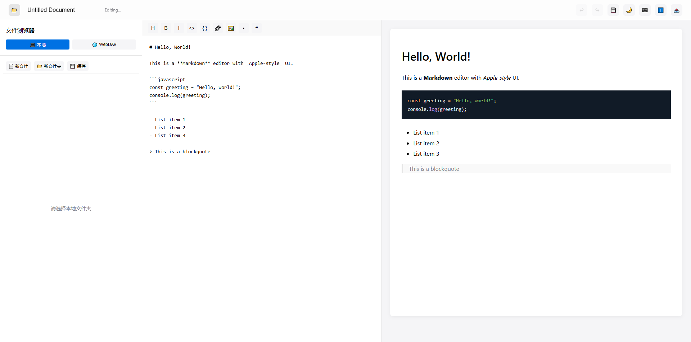

# Markdown Editor

一个功能丰富的Markdown编辑器，支持本地文件和WebDAV存储，提供实时预览和各种Markdown格式工具。
image.png


## 特点

- **现代UI界面**：简洁美观的用户界面，支持亮色/暗色主题切换
- **实时预览**：编辑器和预览区同步滚动，实时渲染Markdown
- **文件管理系统**：
  - 本地文件浏览与编辑
  - WebDAV存储支持
  - 文件/文件夹创建、重命名、删除功能
  - 历史连接记录
  - 密码保存选项
- **强大的编辑工具**：
  - 标题、粗体、斜体、代码、链接等格式工具
  - 代码高亮
  - 快捷键支持
  - 自动保存功能
- **导出功能**：支持导出为Markdown文件、PNG等格式
- **响应式设计**：适应各种屏幕尺寸，侧边栏可调整大小

## 技术栈

- React
- CSS3
- WebDAV客户端库
- react-markdown
- react-syntax-highlighter
- remark-gfm (GitHub Flavored Markdown)
- html2canvas

## 安装与运行

### 前提条件

- Node.js (v14+)
- npm 或 yarn

### 标准安装步骤

1. 克隆仓库
```bash
git clone https://github.com/your-username/markdown-editor.git
cd markdown-editor
```

2. 安装依赖
```bash
npm install
# 或
yarn install
```

3. 启动开发服务器
```bash
npm start
# 或
yarn start
```

4. 构建生产版本
```bash
npm run build
# 或
yarn build
```

### 使用Docker

本项目提供了Docker支持，可以轻松在容器中运行应用。

#### 使用Docker Compose

1. 启动开发环境
```bash
docker-compose up dev
```

2. 启动生产环境
```bash
docker-compose up prod
```

#### 手动构建和运行Docker镜像

1. 构建React应用
```bash
npm run build
```

2. 构建Docker镜像
```bash
docker build -t markdown-editor .
```

3. 运行容器
```bash
docker run -d -p 8080:80 markdown-editor
```

4. 访问应用
在浏览器中打开 http://localhost:8080

#### 使用构建脚本

项目提供了自动化构建脚本，一键完成构建过程:

```bash
# 添加执行权限
chmod +x build.sh

# 运行构建脚本
./build.sh
```

## 使用指南

### 文件存储

- **本地存储**：点击"本地"按钮，选择本地文件夹进行读写
- **WebDAV存储**：点击"WebDAV"按钮，输入服务器信息进行连接
  - 支持自动创建目录
  - 可选择是否保存密码
  - 支持断开连接

### 编辑器功能

- 使用工具栏按钮快速插入Markdown格式
- 快捷键支持：
  - Ctrl+S / Cmd+S：保存文件
  - Ctrl+Z / Cmd+Z：撤销
  - Ctrl+Y / Cmd+Y 或 Ctrl+Shift+Z / Cmd+Shift+Z：重做

### 界面调整

- 可调整侧边栏宽度（拖拽侧边栏边缘）
- 支持切换亮色/暗色主题
- 侧边栏可隐藏，提供更大的编辑空间

## 生产部署

### 使用Nginx

项目包含了优化的Nginx配置，适合生产环境部署:

1. 构建Docker镜像并运行
```bash
docker build -t markdown-editor .
docker run -d -p 80:80 markdown-editor
```

2. 或者直接部署在Nginx服务器上
```bash
# 构建项目
npm run build

# 复制构建文件到Nginx服务目录
cp -r build/* /usr/share/nginx/html/

# 使用项目的Nginx配置
cp nginx.conf /etc/nginx/conf.d/default.conf

# 重启Nginx
systemctl restart nginx
```

## 贡献

欢迎提交Issue和Pull Request，一起完善这个项目！

## 许可证

MIT License
